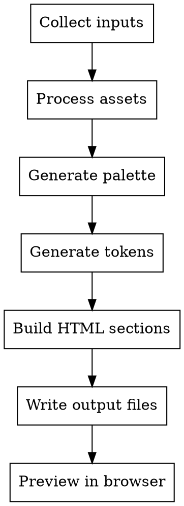

# Brand Guide Generator

Generate comprehensive, professional brand guidelines from existing brand elements. Outputs an interactive HTML brand guide, print-ready PDF, and design tokens (CSS/JSON/Tailwind).

## Input Collection

Gather these from the user. **Required** items are marked; everything else enhances the guide.

| Input | Required | Format |
|-------|----------|--------|
| Brand name | **Yes** | Text |
| Primary color(s) | **Yes** | Hex codes (e.g., `#2563eb`) |
| Primary font | **Yes** | Google Font name OR file path (`.woff2`, `.ttf`, `.otf`) |
| Secondary color(s) | No | Hex codes |
| Body font | No | Google Font name OR file path |
| Logo file(s) | No | File paths (`.svg`, `.png`, `.pdf`) — primary, alternate, icon |
| Tagline | No | Text |
| Mission / Vision | No | Text |
| Core values | No | List of value + description pairs |
| Brand personality | No | 3-5 adjectives (e.g., "Bold, Friendly, Innovative") |
| Voice & tone notes | No | Text describing communication style |
| Screenshots / website URLs | No | For reference extraction |
| Figma export files | No | `.fig` or exported JSON |
| Imagery samples | No | File paths to brand photography |
| Icon files | No | File paths to icon assets |
| Existing brand assets | No | Any partial style guides, PDFs, docs |

### Interactive Collection Flow

Use `AskUserQuestion` to guide the user through input collection in this order:

**Step 1 — Essentials** (single question):
> "What is the brand name, and do you have a tagline?"

**Step 2 — Colors** (ask):
> "What are your brand colors? Provide hex codes and their roles (e.g., primary: #2563eb, secondary: #7c3aed). If you only have 1-2 colors, I'll suggest complementary ones."

**Step 3 — Typography** (ask with options):
> "How would you like to provide fonts?"
> Options: "Google Fonts names" / "Local font files (.woff2, .ttf, .otf)" / "Both"

Then ask for the specific font names or file paths.

**Step 4 — Logo & Assets** (ask with options):
> "Do you have brand assets to include?"
> Options: "Logo files (SVG/PNG)" / "Logo + brand imagery" / "Logo + icons + imagery" / "No assets yet"

If they have assets, ask them to provide the file paths.

**Step 5 — Brand Identity** (ask with options):
> "How much brand identity detail do you want to include?"
> Options: "Just colors & typography (minimal)" / "Add mission, values & personality (standard)" / "Full guide with voice, tone & imagery direction (comprehensive)"

If standard or comprehensive, ask follow-up questions for mission, vision, values, personality adjectives, and voice/tone notes.

**Step 6 — Reference Sources** (ask):
> "Do you have any existing design reference to pull from?"
> Options: "Website URL to analyze" / "Figma exports" / "Screenshots" / "Existing partial brand docs" / "None"

**Step 7 — Output** (ask):
> "Where should I generate the brand guide?"
> Default: `./brand-guide-output/`

After collection, summarize what will be included and confirm before generating.

## Output Structure

All files go into a user-specified output directory (default: `./brand-guide-output/`):

```
brand-guide-output/
├── index.html            # Interactive brand guide
├── styles.css            # Guide stylesheet
├── scripts.js            # Interactive features
├── tokens.css            # CSS custom properties
├── tokens.json           # W3C Design Token format
├── tailwind.config.js    # Tailwind theme extension
└── assets/
    ├── logos/            # All logo files (copied)
    ├── fonts/            # All font files (copied)
    └── imagery/          # All imagery files (copied)
```

## Generation Workflow



### Phase 1: Process Assets

1. Create output directory and `assets/` subdirectories
2. **Logo files**: Copy to `assets/logos/`. Read SVG files to extract for inline use in HTML
3. **Font files**: Copy to `assets/fonts/`. Generate `@font-face` CSS declarations:
   ```css
   @font-face {
     font-family: 'FontName';
     src: url('./assets/fonts/filename.woff2') format('woff2');
     font-weight: 400;
     font-style: normal;
     font-display: swap;
   }
   ```
   For Google Fonts, use: `<link href="https://fonts.googleapis.com/css2?family=FontName:wght@400;500;600;700&display=swap" rel="stylesheet">`
4. **Imagery**: Copy to `assets/imagery/`

### Phase 2: Generate Palette

Run `generate-palette.js` with the user's colors. If bash/Node execution is unavailable, implement the same algorithm using the formulas in `reference/color-system.md`.

```bash
node ~/.claude/skills/brand-guide/scripts/generate-palette.js '{"primary":"#HEX","secondary":"#HEX"}'
```

This produces:
- Full 50-950 tint/shade scales for each color
- Neutral scale (tinted toward primary hue)
- Semantic colors (success, warning, error, info) if not provided
- WCAG contrast matrix
- Suggestions for complementary/analogous colors if palette is thin

Review the contrast matrix. Flag any common pairings that fail WCAG AA. Adjust colors if needed.

### Phase 3: Generate Tokens

Run `generate-tokens.js`:

```bash
node ~/.claude/skills/brand-guide/scripts/generate-tokens.js brand-data.json ./brand-guide-output/
```

Input `brand-data.json` structure:
```json
{
  "palette": { /* output from generate-palette.js */ },
  "fonts": { "display": "FontName", "body": "FontName" },
  "baseFontSize": 16,
  "typeRatio": 1.25,
  "baseSpacingUnit": 4
}
```

Produces `tokens.css`, `tokens.json`, `tailwind.config.js`.

### Phase 4: Build HTML

Read the template from `~/.claude/skills/brand-guide/templates/html-template.html`.

Replace all `{{PLACEHOLDER}}` tokens with generated content. **Every** placeholder in the template must be replaced or the section removed.

**Important:** For `{{CSS_TOKENS}}` in `html-styles.css`, insert only the inner declarations (no `:root {}` wrapper) — the CSS file already has a `:root {}` block. Use `generateCSSDeclarations()` from `generate-tokens.js` instead of `generateCSS()`.

**Important:** For sections where the user provided no data, remove the entire `<section>` block AND its corresponding `<li>` nav link from the HTML. Don't leave empty sections.

| Placeholder | Content | Required |
|-------------|---------|----------|
| `{{BRAND_NAME}}` | Brand name | Yes |
| `{{BRAND_TAGLINE}}` | Tagline text | No — remove if empty |
| `{{VERSION}}` | `"1.0"` or user-specified | Yes — default `"1.0"` |
| `{{DATE}}` | Today's date (YYYY-MM-DD) | Yes |
| `{{FONT_IMPORTS}}` | `@font-face` blocks or Google Fonts `<link>` | Yes |
| `{{PRIMARY_COLOR}}` | Primary hex (for guide accent color) | Yes |
| `{{CSS_TOKENS}}` | CSS declarations only (no `:root` wrapper) | Yes |
| `{{BRAND_LOGO_SMALL}}` | `` tag for nav logo (28px height) | No — use text fallback |
| `{{BRAND_LOGO_FULL}}` | `` tag for cover logo (120px height) | No — use brand name as `<h1>` |
| `{{LOGO_SMALL}}` | Small logo `` for don'ts section | No — skip don'ts if no logo |
| `{{BRAND_MISSION}}` | Mission statement text | No |
| `{{BRAND_VISION}}` | Vision statement text | No |
| `{{BRAND_VALUES}}` | `.value-item` divs with `.value-name` + `.value-description` | No |
| `{{BRAND_PERSONALITY}}` | `.personality-tag` spans | No |
| `{{LOGO_VARIANTS}}` | `.logo-variant` divs with logo images on light/dark | No |
| `{{LOGO_CLEARSPACE_VISUAL}}` | Visual showing clear space around logo | No |
| `{{LOGO_DOWNLOAD_LINKS}}` | `.download-link` anchors for each logo file | No |
| `{{COLOR_PALETTES}}` | Color swatch HTML (see format below) | Yes |
| `{{CONTRAST_MATRIX_TABLE}}` | `<table>` with contrast ratios between key colors | Yes |
| `{{FONT_SPECIMENS}}` | `.font-specimen` divs with font name + character display | Yes |
| `{{TYPE_SCALE_DISPLAY}}` | `.type-scale-item` divs at each scale size | Yes |
| `{{WEIGHT_SCALE_DISPLAY}}` | `.weight-item` divs for each available font weight | Yes |
| `{{FONT_DOWNLOAD_LINKS}}` | `.download-link` anchors for each font file | No |
| `{{SPACING_SCALE_VISUAL}}` | `.spacing-item` divs with colored bars | Yes |
| `{{RADIUS_VISUAL}}` | `.radius-item` divs with styled preview boxes | Yes |
| `{{SHADOW_VISUAL}}` | `.shadow-item` divs with shadow preview boxes | Yes |
| `{{IMAGERY_CONTENT}}` | `.imagery-grid` with sample images, or remove section | No |
| `{{ICONOGRAPHY_CONTENT}}` | Icon grid display, or remove section | No |
| `{{VOICE_TONE_CONTENT}}` | Tone spectrum + do/don't lists, or remove section | No |
| `{{TOKENS_CSS}}` | Raw CSS token content (full `:root {}` block) for code display | Yes |
| `{{TOKENS_JSON}}` | Raw JSON token content for code display | Yes |
| `{{TOKENS_TAILWIND}}` | Raw Tailwind config for code display | Yes |

For each **color palette**, generate swatch HTML:
```html
<div class="color-palette">
  <h3 class="color-palette-title">Primary</h3>
  <div class="color-scale">
    <div class="color-swatch" style="background:#hex" data-hex="#hex" data-light-text>
      <span class="color-swatch-label">50</span>
      <span class="color-swatch-hex">#hex</span>
    </div>
    <!-- ... 50 through 950 ... -->
  </div>
</div>
```
Add `data-light-text` attribute on swatches darker than 50% lightness.

For **type scale**, generate:
```html
<div class="type-scale-item">
  <span class="type-scale-label">2xl</span>
  <span class="type-scale-size">1.953rem</span>
  <span class="type-scale-sample" style="font-size:1.953rem">The quick brown fox</span>
</div>
```

For **spacing scale**, generate visual bars:
```html
<div class="spacing-item">
  <span class="spacing-label">4</span>
  <div class="spacing-bar" style="width:16px"></div>
  <span class="spacing-value">1rem / 16px</span>
</div>
```

### Phase 5: Write Output

1. Copy `html-styles.css` → `styles.css` (replace `{{PRIMARY_COLOR}}` and `{{CSS_TOKENS}}`)
2. Copy `html-scripts.js` → `scripts.js`
3. Write the assembled HTML → `index.html`
4. Token files already written by generate-tokens.js

### Phase 6: Preview

If preview tools are available, open the HTML file in browser. Otherwise, tell the user:
> Brand guide generated at `./brand-guide-output/index.html`. Open in a browser to view.
> Print to PDF using browser's print dialog (Ctrl/Cmd+P) for the PDF version.

## Section Content Guide

Read `reference/brand-guide-sections.md` for detailed content requirements per section.

**Minimum viable guide** (just name + colors + font): Sections 1, 4, 5, 11
**Standard guide** (+ logo + personality): Add sections 2, 3, 6, 9, 10
**Comprehensive guide** (+ imagery + icons): All 11 sections

Only include sections for which the user has provided relevant inputs. Don't generate empty placeholder sections.

## Reference Files

For detailed specifications, read these as needed:
- `reference/color-system.md` — WCAG standards, tint/shade algorithms, color harmony
- `reference/typography-system.md` — Type scales, font pairing, responsive typography
- `reference/design-tokens-spec.md` — Token formats, naming conventions
- `reference/brand-guide-sections.md` — Section content requirements and best practices

## Quality Checklist

Before delivering, verify:
- [ ] All color pairings pass WCAG AA (4.5:1 for text, 3:1 for large text/UI)
- [ ] Typography scale follows a consistent modular ratio
- [ ] All imported files (logos, fonts, images) are copied to assets/
- [ ] HTML renders correctly and navigation works
- [ ] Dark mode toggle functions
- [ ] Click-to-copy works on color swatches
- [ ] Token files (CSS, JSON, Tailwind) are valid and complete
- [ ] Print stylesheet produces clean PDF output
- [ ] No empty or placeholder sections in the final output
